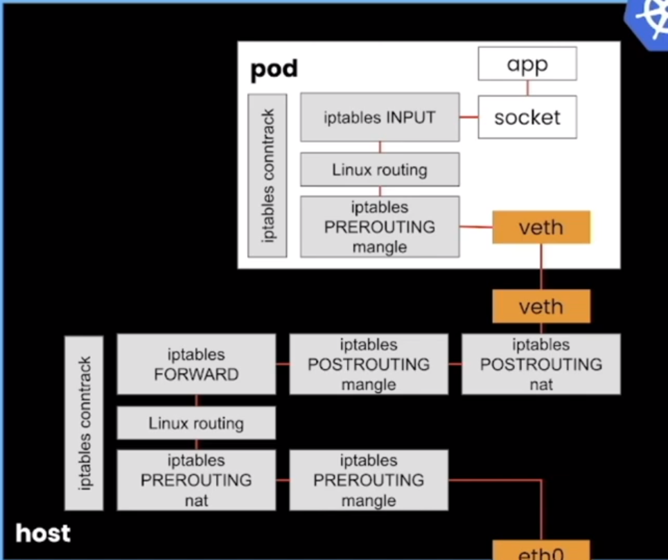

# Container networking

An example of creating multiple L2 networks, one on each of the nodes. Each network contains 2 network namespaces (containers), connected via a bridge, and have different subnets. The containers are connected via static routing rules set on each of the nodes. Inter node routing can be configured either with BGP or static routing.

The example also includes a NAT scenario which exposes a udp server on one of the nodes. The NAT can be configured either with iptables or eBPF XDP.


Create the 2 VMs (node01 and node02):

```
vagrant up
```

SSH to each node (VM) in turn, and run the setup script to create the network namespaces connected via a bridge: 

```
make setup_static # for static routing
# or
make setup_bgp    # for bgp routing
```

To test the connectivity between the containers within and node, and across nodes, run the following:

```
make test
```

To test UDP server under NAT using **iptables**:


```
make test_udp_server_iptables # on one tab
make test_udp_client # on other tab
```

To test UDP server under NAT using **ebpf**:


```
make test_udp_server_ebpf # on one tab
make test_udp_client # on other tab
```


To tear-down the network:

```11
make teardown
```

To destroy the vagrant setup

```
vagrant -f destroy
```

This project is based on work done by  [Shane Utt](https://github.com/shaneutt/ebpf-xdp-golang-redirect-demo/tree/main)  and [Kristen Jacobs.](https://github.com/kristenjacobs/container-networking)
